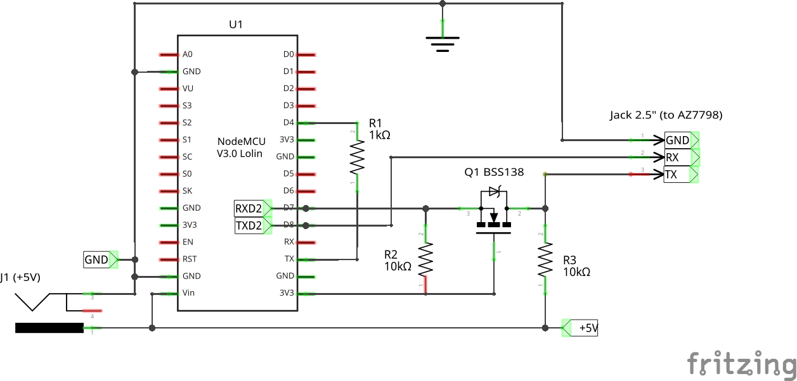

# What for?
- periodic read CO2/Temperature/Humidity from AZ 7798 meter on esp8266 and send data to HTTP-server via WiFi
- this collected data then may be used for logging and build graphs or something else

# Schema

# How it works?
every 60 seconds it:
- requests current values of CO2/Temperature/Humidity from AZ 7798
- sends POST-request to HTTP-server on configured url
  - payload format: "TT.T CCC HH.H"
    - TT.T — floating point value of Temperature
    - CCC — integer value of CO2
    - HH.H — floating point value of Humidity

# Deploy
1. make the circuit
2. git clone https://github.com/silversed/az7798_logger.git
3. edit file az7798_logger_settings.h: set your WiFi network name/password and HTTP-server url
4. build the sketch and flash esp8266
